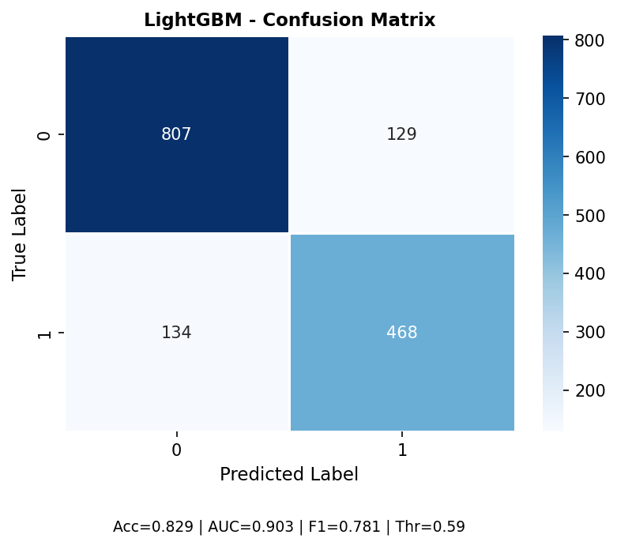
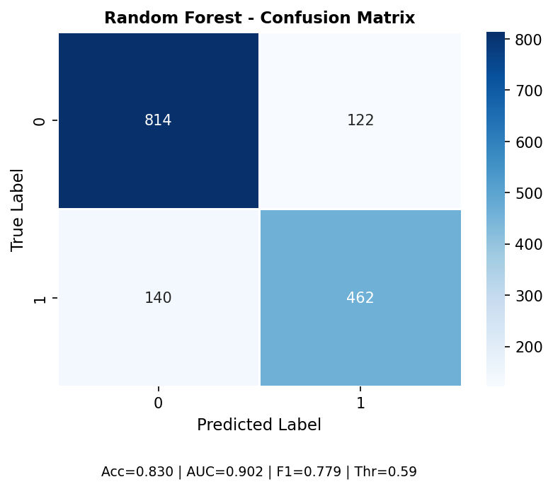
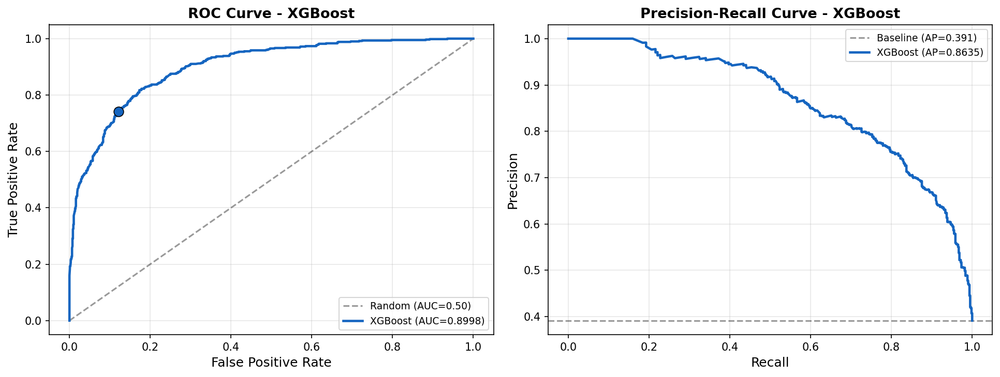
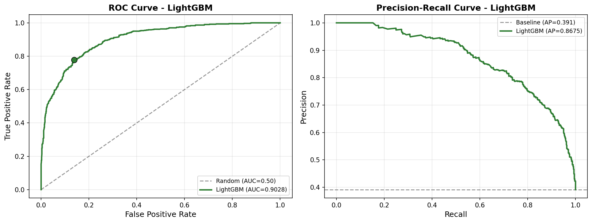

# Lead Scoring - Dự đoán khả năng chuyển đổi khách hàng tiềm năng

> Đồ án môn **Máy học - CS114.Q22**  
> Chủ đề: Ứng dụng Machine Learning trong dự đoán tỷ lệ chuyển đổi khách hàng trên bộ dữ liệu **Lead Scoring - X Education**.

---

## 1. Giới thiệu bài toán

Trong hoạt động tuyển sinh và marketing, doanh nghiệp thường thu thập rất nhiều **lead** - khách hàng tiềm năng đã để lại thông tin hoặc tương tác với website. Tuy nhiên, không phải lead nào cũng có khả năng chuyển đổi thành khách hàng thật sự.

Dự án này xây dựng hệ thống **Lead Scoring** nhằm dự đoán khả năng một lead sẽ chuyển đổi dựa trên các thông tin như:

- Nguồn phát sinh lead.
- Hành vi truy cập website.
- Hoạt động tương tác gần nhất.
- Nghề nghiệp, hồ sơ khách hàng và mức độ quan tâm.
- Các đặc trưng tổng hợp được tạo ra từ dữ liệu hành vi.

Bài toán được mô hình hóa dưới dạng **phân loại nhị phân**:

| Nhãn | Ý nghĩa |
|---|---|
| `0` | Lead chưa chuyển đổi |
| `1` | Lead đã chuyển đổi |

Mục tiêu cuối cùng là giúp doanh nghiệp ưu tiên chăm sóc những lead có khả năng chuyển đổi cao, từ đó tối ưu nguồn lực tư vấn và tăng hiệu quả marketing.

---

## 2. Bộ dữ liệu

Dự án sử dụng bộ dữ liệu **Lead Scoring Dataset** của X Education trên Kaggle.

- Dữ liệu ban đầu: **9.240 dòng, 37 cột**.
- Sau làm sạch: **7.690 dòng, 16 cột**.
- Sau feature engineering và feature selection: dữ liệu huấn luyện còn **6 đặc trưng đầu vào** và **1 biến mục tiêu**.

Các file dữ liệu đã chọn đặc trưng cuối cùng được lưu sẵn trong repository:

| File | Mô tả | Kích thước |
|---|---|---|
| `Leads_Selected_Train.csv` | Tập huấn luyện sau chọn lọc đặc trưng | 6.152 mẫu, 7 cột |
| `Leads_Selected_Test.csv` | Tập kiểm thử sau chọn lọc đặc trưng | 1.538 mẫu, 7 cột |

Các đặc trưng cuối cùng gồm:

| Đặc trưng | Ý nghĩa |
|---|---|
| `Lead Origin` | Nguồn khởi tạo lead |
| `Last Activity` | Hoạt động gần nhất của lead |
| `What is your current occupation` | Nghề nghiệp hiện tại |
| `Lead Profile` | Hồ sơ/chất lượng lead |
| `pvps_totalvisits` | Đặc trưng tương tác giữa số trang xem và số lượt truy cập |
| `Engagement_Score` | Điểm tổng hợp mức độ tương tác |
| `Converted` | Biến mục tiêu cần dự đoán |

---

## 3. Quy trình thực hiện

Dự án được triển khai theo pipeline sau:

```text
Dữ liệu thô
   ↓
Khám phá dữ liệu - EDA
   ↓
Làm sạch dữ liệu
   ↓
Xử lý outlier
   ↓
Mã hóa biến phân loại
   ↓
Feature Engineering
   ↓
Feature Selection
   ↓
Huấn luyện mô hình
   ↓
Tối ưu siêu tham số
   ↓
Đánh giá và so sánh mô hình
```

### 3.1. Làm sạch dữ liệu

Các bước chính:

- Loại bỏ cột định danh như `Prospect ID`, `Lead Number`.
- Loại bỏ các cột có quá nhiều giá trị thiếu hoặc ít ý nghĩa dự đoán.
- Loại bỏ các cột gần như hằng số, phương sai thấp.
- Điền missing value:
  - Biến phân loại: điền bằng `Unknown`.
  - Biến số: điền bằng median.
- Loại bỏ các bản ghi trùng sau khi giảm chiều dữ liệu.

### 3.2. Xử lý outlier

Dự án xử lý hai nhóm outlier:

- **Biến số:** dùng phương pháp IQR để giới hạn giá trị cực đoan.
- **Biến phân loại:** gộp các nhóm có tần suất nhỏ hơn 1% vào các nhóm tổng quát hơn như `Other`, `Not Specified` hoặc nhóm có ý nghĩa nghiệp vụ tương đồng.

### 3.3. Feature Engineering

Một số đặc trưng mới được xây dựng:

| Đặc trưng | Công thức / Ý nghĩa |
|---|---|
| `ttspow_pvps` | Tương tác giữa thời gian trên website và số trang xem mỗi lượt |
| `tttspow_totalvisits` | Tương tác giữa thời gian trên website và tổng số lượt truy cập |
| `pvps_totalvisits` | Tương tác giữa số trang xem mỗi lượt và tổng số lượt truy cập |
| `Time_Per_Page` | `Total Time Spent on Website / (Page Views Per Visit + 1)` |
| `Time_Per_Visit` | `Total Time Spent on Website / (TotalVisits + 1)` |
| `Engagement_Score` | `0.25 * TotalVisits + 0.25 * Page Views Per Visit + 0.5 * Total Time Spent on Website` |
| `Engagement_Level` | Mức độ tương tác dựa trên số hành vi vượt trung vị |

### 3.4. Feature Selection

Quy trình chọn đặc trưng gồm nhiều tầng:

1. **Low Variance Filter:** loại bỏ đặc trưng có phương sai thấp.
2. **Mutual Information:** đo mức liên hệ phi tuyến giữa từng đặc trưng và biến mục tiêu.
3. **Multicollinearity Check:** loại bỏ đặc trưng tương quan cao để giảm đa cộng tuyến.
4. **Embedded Selection:** dùng Gradient Boosting để đánh giá độ quan trọng đặc trưng.
5. **RFECV:** xác nhận số lượng đặc trưng tối ưu bằng Recursive Feature Elimination with Cross-Validation.

Kết quả cuối cùng giữ lại **6 đặc trưng** quan trọng nhất để huấn luyện mô hình.

---

## 4. Mô hình sử dụng

Dự án thử nghiệm và so sánh nhiều mô hình học máy cho bài toán phân loại nhị phân:

| Mô hình | Vai trò |
|---|---|
| Logistic Regression | Mô hình tuyến tính cơ sở, dễ giải thích |
| Support Vector Machine | Mô hình phân loại dựa trên siêu phẳng phân tách |
| XGBoost | Mô hình boosting mạnh, kiểm soát overfitting tốt |
| LightGBM | Gradient Boosting tối ưu tốc độ và bộ nhớ |
| Random Forest | Mô hình ensemble ổn định, dễ triển khai |

Các mô hình nâng cao như **XGBoost**, **LightGBM** và **Random Forest** được tối ưu bằng **Optuna** trên Stratified Cross-Validation, sau đó chọn ngưỡng phân loại tối ưu dựa trên Out-of-Fold prediction.

---

## 5. Kết quả chính

### 5.1. Kết quả với Optuna

| Mô hình | Accuracy | ROC-AUC | F1 Positive | Average Precision | Threshold |
|---|---:|---:|---:|---:|---:|
| XGBoost | 0.8244 | 0.8998 | 0.7676 | 0.8635 | 0.650 |
| LightGBM | 0.8290 | **0.9028** | **0.7807** | **0.8675** | 0.590 |
| Random Forest | **0.8296** | 0.9019 | 0.7791 | 0.8627 | 0.590 |

### 5.2. Nhận xét

- **Random Forest** đạt Accuracy cao nhất: **0.8296**.
- **LightGBM** đạt ROC-AUC cao nhất: **0.9028**.
- Nhóm mô hình ensemble như XGBoost, LightGBM và Random Forest cho kết quả tốt hơn các mô hình cơ sở.
- `Engagement_Score` là một trong những đặc trưng quan trọng nhất, cho thấy mức độ tương tác trên website có ảnh hưởng lớn đến khả năng chuyển đổi.

---

## 6. Cấu trúc thư mục

```text
LEAD SCORING/
│
├── BasicEDA.ipynb
├── Process_Ouliers.ipynb
├── Leads_Engineering.ipynb
├── Feature_Selection.ipynb
│
├── Model_LogisticRegression.ipynb
├── Model_SVM.ipynb
├── xgb_lgb_rf_optuna.ipynb
├── linh.ipynb
│
├── Leads_Selected_Train.csv
├── Leads_Selected_Test.csv
│
├── outputs/
│   ├── best_params_LightGBM.json
│   ├── best_params_Random_Forest.json
│   ├── best_params_XGBoost.json
│   ├── model_LightGBM.pkl
│   ├── model_Random_Forest.pkl
│   ├── model_XGBoost.pkl
│   ├── cm_LightGBM.png
│   ├── cm_Random_Forest.png
│   ├── cm_XGBoost.png
│   ├── LightGBM_roc_pr.png
│   ├── Random Forest_roc_pr.png
│   └── XGBoost_roc_pr.png
│
├── results/
│   ├── auc/
│   ├── confusion_matrix/
│   └── models/
│
├── CS114Q22_Group6_Report.pdf
└── Group 6-Slides.pdf
```

---

## 7. Cài đặt môi trường

### 7.1. Tạo môi trường ảo

Trên Windows:

```bash
python -m venv .venv
.venv\Scripts\activate
```

Trên macOS/Linux:

```bash
python3 -m venv .venv
source .venv/bin/activate
```

### 7.2. Cài đặt thư viện

```bash
pip install pandas numpy matplotlib seaborn scikit-learn optuna xgboost lightgbm joblib jupyter
```

### 7.3. Mở Jupyter Notebook

```bash
jupyter notebook
```

---

## 8. Cách chạy dự án

### Cách 1: Chạy nhanh từ dữ liệu đã chọn đặc trưng

Nếu chỉ muốn huấn luyện và đánh giá mô hình, có thể chạy trực tiếp các notebook sau vì repository đã có sẵn:

```text
Leads_Selected_Train.csv
Leads_Selected_Test.csv
```

Thứ tự chạy đề xuất:

```text
1. Model_LogisticRegression.ipynb
2. Model_SVM.ipynb
3. xgb_lgb_rf_optuna.ipynb
```

Notebook `xgb_lgb_rf_optuna.ipynb` sẽ huấn luyện và đánh giá các mô hình:

- XGBoost
- LightGBM
- Random Forest

Kết quả gồm model, tham số tốt nhất, confusion matrix, ROC curve và Precision-Recall curve sẽ được lưu trong thư mục `outputs/`.

### Cách 2: Chạy lại toàn bộ pipeline từ dữ liệu thô

Để chạy lại toàn bộ quy trình từ đầu, cần tải file dữ liệu gốc `Leads.csv` từ Kaggle và đặt vào thư mục dự án.

Thứ tự chạy đề xuất:

```text
1. BasicEDA.ipynb
2. Process_Ouliers.ipynb
3. Leads_Engineering.ipynb
4. Feature_Selection.ipynb
5. Model_LogisticRegression.ipynb
6. Model_SVM.ipynb
7. xgb_lgb_rf_optuna.ipynb
```

> Lưu ý: một số notebook trong bản nộp có thể đang dùng đường dẫn tương đối khác nhau. Nếu chạy lại toàn bộ pipeline, cần kiểm tra và chỉnh lại đường dẫn đọc/ghi file cho thống nhất, ví dụ các file trung gian như `Cleaned_Leads.csv`, `Processed_Leads.csv`, `Leads_Engineered_Scaled_Train.csv` và `Leads_Engineered_Scaled_Test.csv`.

---

## 9. Minh họa kết quả

### Confusion Matrix

| XGBoost | LightGBM | Random Forest |
|---|---|---|
|  |  |  |

### ROC Curve và Precision-Recall Curve

| XGBoost | LightGBM | Random Forest |
|---|---|---|
|  |  |  |

---

## 10. Tài liệu đi kèm

Repository có kèm theo:

| File | Nội dung |
|---|---|
| `CS114Q22_Group6_Report.pdf` | Báo cáo chi tiết đồ án |
| `Group 6-Slides.pdf` | Slide thuyết trình |
| `outputs/*.pkl` | Mô hình đã huấn luyện |
| `outputs/best_params_*.json` | Bộ siêu tham số tốt nhất |
| `outputs/*.png` | Biểu đồ đánh giá mô hình |

---

## 11. Hướng phát triển

Một số hướng mở rộng có thể thực hiện:

- Xây dựng giao diện demo để nhập thông tin lead và dự đoán khả năng chuyển đổi.
- Triển khai API bằng Flask hoặc FastAPI.
- Thử nghiệm thêm các mô hình ensemble hoặc stacking.
- Tối ưu threshold theo mục tiêu kinh doanh, ví dụ ưu tiên recall để không bỏ sót lead tiềm năng.
- Bổ sung phân tích explainability bằng SHAP hoặc permutation importance.
- Kiểm thử mô hình trên dữ liệu mới để đánh giá khả năng tổng quát hóa.

---

## 12. Thành viên thực hiện

**Nhóm 6 - CS114.Q22 - Máy học**

| MSSV | Họ và tên |
|---|---|
| 23520824 | Võ Anh Kiệt |
| 23520825 | Võ Anh Kiệt |
| 23520816 | Phạm Anh Kiệt |
| 23520845 | Lê Xuân Song Lĩnh |
| 23520878 | Lê Quang Long |

---

## 13. Kết luận

Dự án đã xây dựng thành công quy trình Machine Learning hoàn chỉnh cho bài toán Lead Scoring, từ tiền xử lý dữ liệu, tạo đặc trưng, chọn đặc trưng đến huấn luyện và đánh giá mô hình. Kết quả cho thấy các mô hình ensemble, đặc biệt là **LightGBM** và **Random Forest**, đạt hiệu năng tốt với ROC-AUC khoảng **0.90**, đủ tiềm năng để hỗ trợ doanh nghiệp ưu tiên chăm sóc các lead có khả năng chuyển đổi cao.
